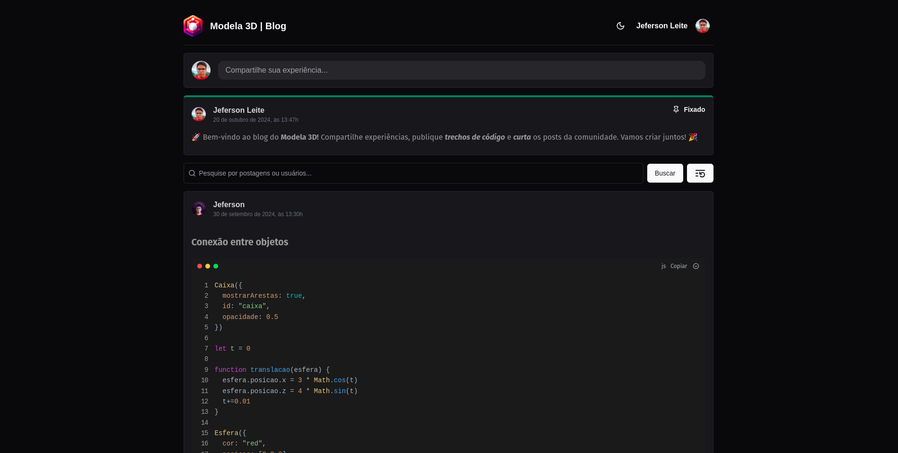

## Modela 3D Blog

<div align="center">
  
</div>

## 🎯 Objetivo

O Modela 3D Blog é uma plataforma interativa onde usuários podem compartilhar suas experiências, projetos e conhecimentos relacionados ao mundo da modelagem 3D. Com um sistema de posts, curtidas, comentários e um editor Markdown intuitivo, o blog visa construir uma comunidade engajada e promover a troca de informações entre entusiastas e profissionais da área.

## ✨ Funcionalidades

- **Autenticação de Usuários:** Acesso seguro e personalizado através da plataforma Clerk.
- **Criação de Posts:** Publique suas ideias, tutoriais e projetos com um editor Markdown completo.
- **Feed de Posts:** Explore o feed de posts da comunidade, com paginação para navegação otimizada.
- **Curtidas e Comentários:** Interaja com outros usuários curtindo os posts.
- **Pesquisa:** Encontre posts e usuários específicos através da barra de pesquisa.
- **Tema Dark/Light/System:** Personalize sua experiência com a opção de alternar entre os temas claro e escuro.
- **Responsividade:** Design responsivo que se adapta a diferentes dispositivos.

## 🚀 Tecnologias Utilizadas

**Frontend:**

- Next.js
- React
- TypeScript
- Tailwind CSS
- Shadcn UI
- Clerk
- Tanstack Query
- Lucide React
- MD-Editor-RT
- Date-fns

**Backend:**

- Next.js API Routes
- Drizzle ORM
- Neon Database

**Ferramentas:**

- Drizzle Kit
- ESLint
- Prettier

## 💻 Instalação e Execução

1. Clone o repositório:

```bash
git clone https://github.com/jefersonapps/modela3d-blog.git
```

2. Navegue até o diretório do projeto:

```bash
cd modela3d-blog
```

3. Instale as dependências:

```bash
npm install
```

4. Crie o arquivo `.env.local` na raiz do projeto e configure as variáveis de ambiente:

```
NEON_DATABASE_URL=
NEXT_PUBLIC_CLERK_PUBLISHABLE_KEY=
CLERK_SECRET_KEY=
```

5. Execute as migrações do banco de dados:

```bash
npm run migrate
npm run db-create
```

6. Inicie o servidor de desenvolvimento:

```bash
npm run dev
```

## 🤝 Contribuindo

Sinta-se à vontade para contribuir com o projeto! Se você encontrar algum problema, tiver sugestões de novas funcionalidades ou quiser melhorar a documentação, abra uma issue ou envie um pull request.

## 📝 Licença

Este projeto está licenciado sob a licença MIT. Consulte o arquivo [LICENSE](LICENSE) para obter mais detalhes.
